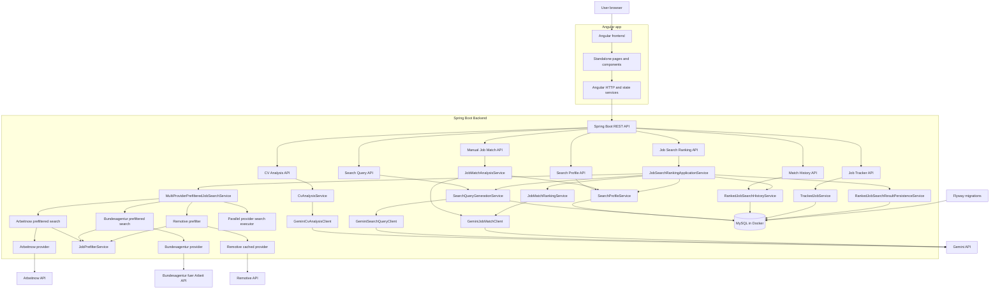
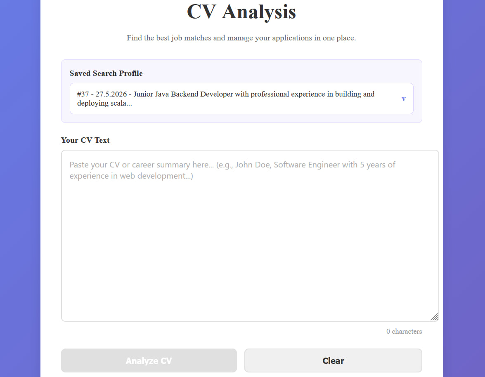
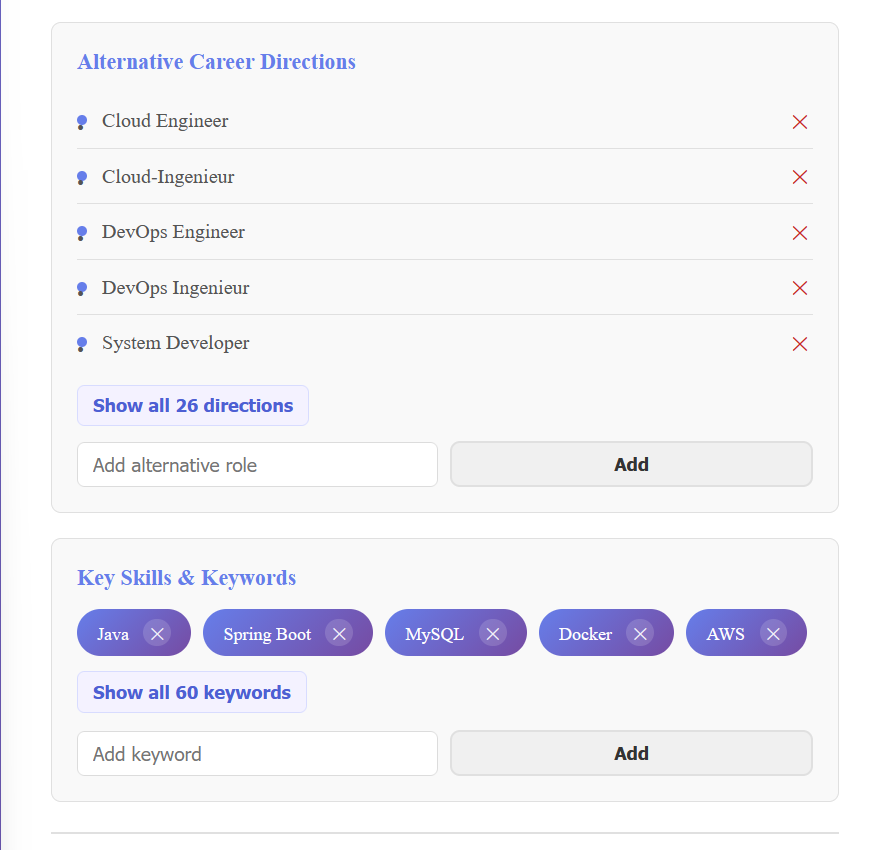
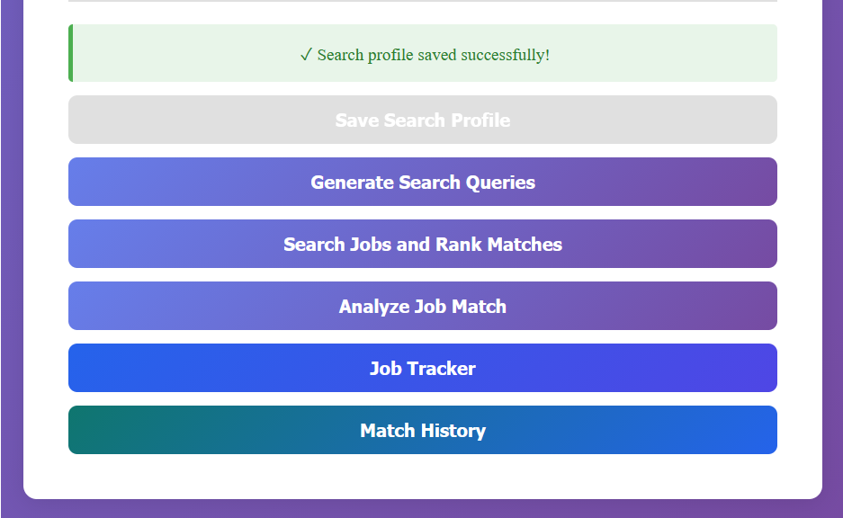
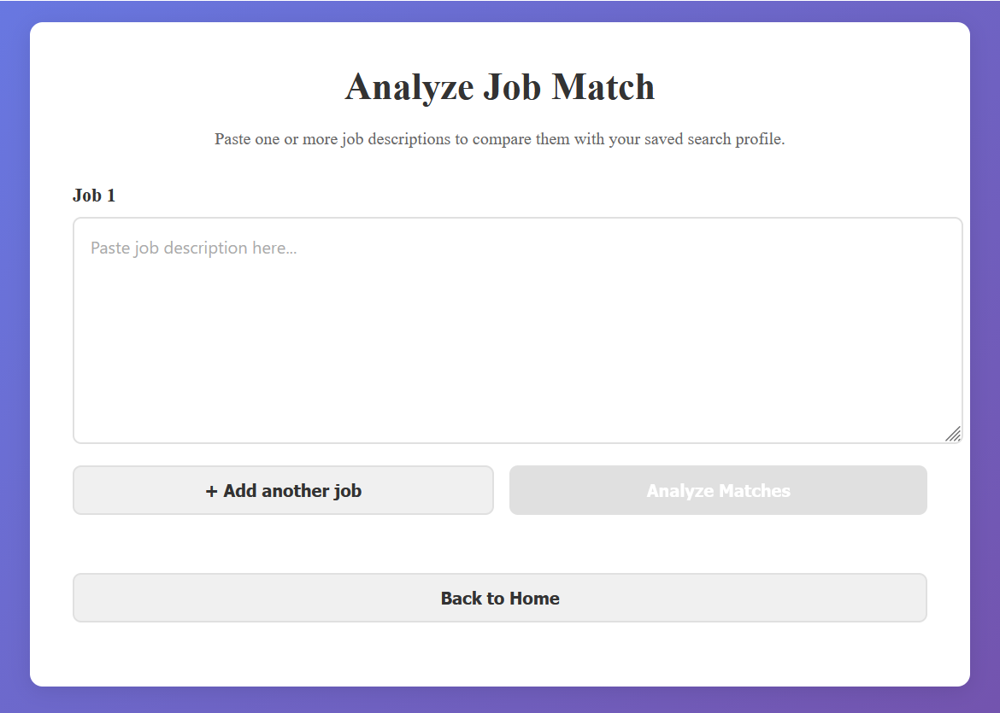
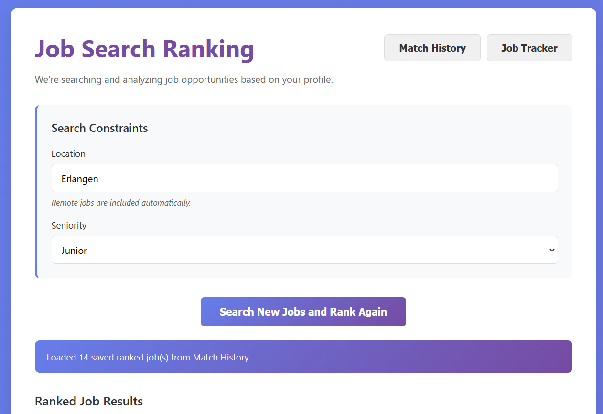
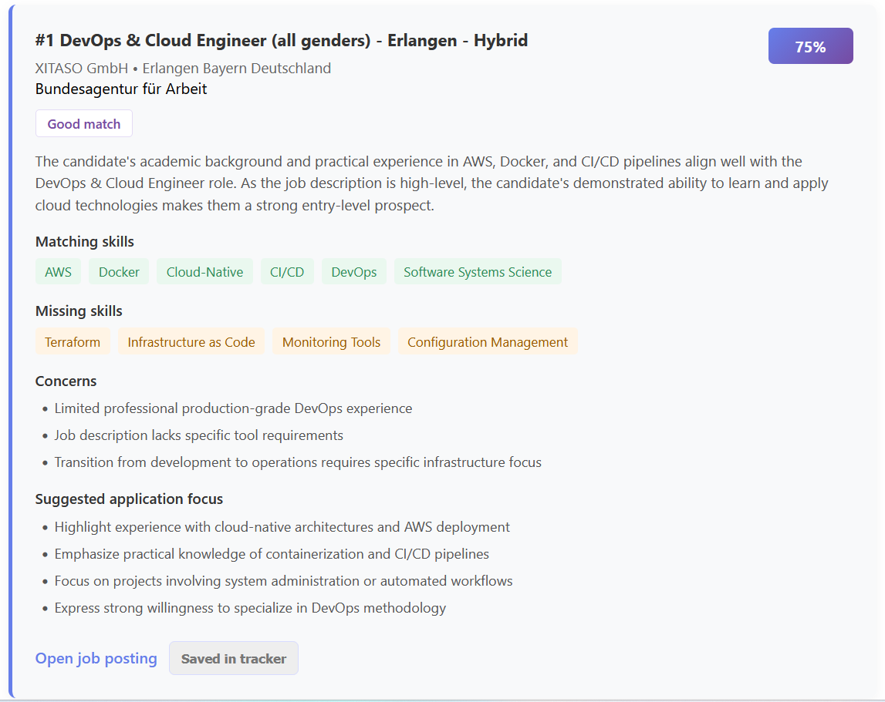
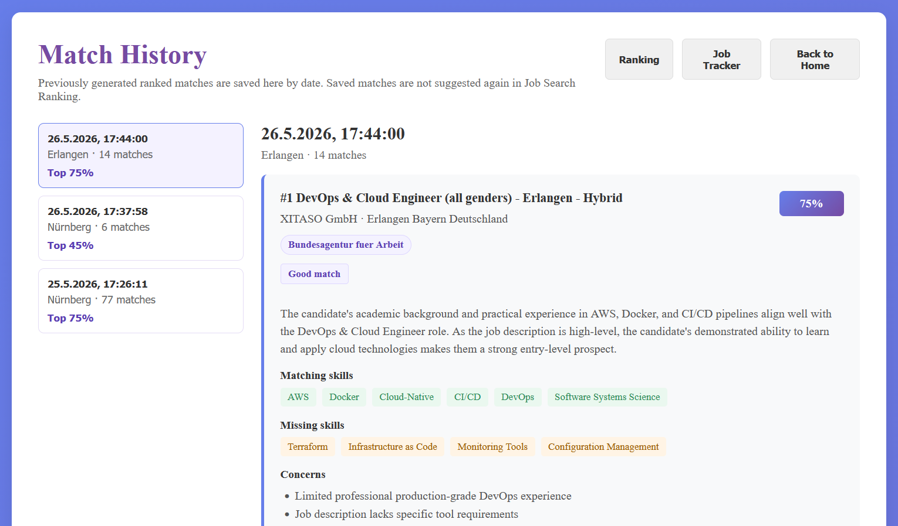
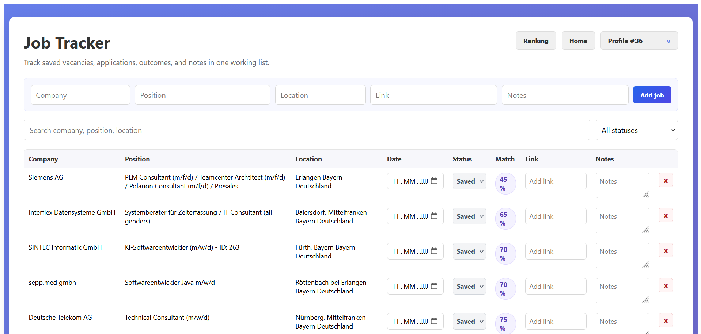

# CareerFlow

CareerFlow is an AI-assisted job search assistant for building and managing a targeted job search across different professions and seniority levels. It analyzes pasted CV text, turns the extracted information into reusable search profiles, generates practical job search queries, collects vacancies from multiple providers, filters out unsuitable roles, scores job/profile matches with Gemini, ranks them in the backend, and helps track applications in a lightweight CRM-style workflow.

## Why I Built This

The goal was to solve a real problem: job search often requires candidates to manually search across platforms, compare vacancies with their CV, remember which jobs were already analyzed, and track applications.

CareerFlow brings these steps into one workflow by combining AI-assisted profile analysis, external job provider search, local filtering, backend ranking, Match History, and application tracking.

## Features

**Core Workflow**

- Analyzes pasted CV text and extracts a profile summary, suggested search roles, alternative career roles, and keywords
- Saves the edited CV analysis as reusable search profiles
- Generates and saves practical job search queries for each saved profile
- Searches for vacancies based on the saved profile, generated queries, selected location, and seniority preference
- Scores filtered vacancies with Gemini and ranks them by match score in the backend
- Analyzes one or more manually pasted job descriptions against a saved search profile

**History And Application Tracking**

- Saves generated ranking runs in Match History, a dated archive of previously suggested matches
- Lets the user add selected matches from Ranking or Match History to Job Tracker, a CRM-style table for applications the user wants to actively follow
- Supports manual job entries in Job Tracker for opportunities found outside the app
- Tracks application status, applied date, job link, notes, and match score in Job Tracker

**Search Control And Filtering**

- Lets the user review and edit extracted search roles, alternative career roles, keywords, and generated queries
- Lets the user choose the target seniority level: junior or senior/middle
- Prefilters vacancies before Gemini match scoring to reduce noise and avoid unnecessary API calls
- Excludes jobs already saved in Match History from future ranking for the same profile

**Saved Profile Convenience**

- Loads saved profiles so the user can continue a search without pasting the CV again

## Job Sources

CareerFlow currently collects jobs from:

- Bundesagentur fuer Arbeit
- Arbeitnow
- Remotive

These providers do not require API keys. Only Gemini requires an API key.

## Key Technical Decisions

- The backend performs ranking instead of the frontend, so match scoring, filtering, sorting, and persistence stay consistent.
- Jobs are prefiltered before Gemini scoring to reduce noise and avoid unnecessary AI API calls.
- Ranking results are saved in Match History to avoid repeatedly scoring the same jobs for the same profile.
- Search queries are stored and reused, so Gemini is not called again when saved queries already exist.
- Job providers are normalized into a common `JobSearchResult` model before filtering and ranking.
- Provider search runs in parallel with a dedicated executor, while Gemini scoring stays sequential to reduce free-tier rate-limit pressure.

## Tech Stack

**Backend**

- Java 21
- Spring Boot
- Spring Data JPA
- Spring Security
- Flyway
- MySQL 8
- Gemini API

**Frontend**

- Angular
- TypeScript
- HTML
- RxJS
- CSS

**Infrastructure**

- Docker Compose for local MySQL

## Product Workflow

```mermaid
flowchart TB
    Start([User opens the app])

    subgraph ProfileSetup[1. Profile setup]
        Start --> CvInput[User pastes CV text]
        CvInput --> CvAnalysis[System sends CV text to Gemini for analysis]
        CvAnalysis --> ExtractedProfileData[System shows CV-based profile summary, search roles, alternative career roles and keywords]
        ExtractedProfileData --> EditProfileData[User reviews and edits the CV-based profile data]
        EditProfileData --> SaveProfile[System saves the edited data as a search profile]
        SaveProfile --> ProfileReady[Saved profile is ready to use]

        Start --> SelectProfile[User selects an existing saved profile]
        SelectProfile --> LoadProfile[System loads saved profile data]
        LoadProfile --> ProfileReady

        LoadProfile --> EditLoadedProfile[User edits loaded roles, alternative career roles or keywords]
        EditLoadedProfile --> SaveAsNewProfile[System saves edited data as a new search profile]
        SaveAsNewProfile --> ProfileReady
    end

    subgraph ProfileActions[2. Actions after a profile is ready]
        ProfileReady --> StartRanking[User starts job search and ranking]
        ProfileReady --> ManageQueries[User opens generated search queries]
        ProfileReady --> ManualMatchStart[User opens manual job match analysis]
        ProfileReady --> OpenMatchHistory[User opens Match History]
        ProfileReady --> OpenJobTracker[User opens Job Tracker]
        StartRanking --> RankingQueryCheck{Saved generated queries exist?}
        ManageQueries --> QueryPageCheck{Saved generated queries exist?}
    end

    subgraph QuerySetup[3. Search query preparation]
        QueryPageCheck -- Yes --> LoadQueries[System loads saved generated queries]
        QueryPageCheck -- No --> GenerateQueries[System generates search queries with Gemini]
        RankingQueryCheck -- No --> GenerateQueries
        RankingQueryCheck -- Yes --> SearchConstraints
        GenerateQueries --> QueryLists[System shows role-title, requirement-based and alternative-direction queries]
        LoadQueries --> QueryLists
        QueryLists --> EditQueries[User reviews, edits, deletes or adds queries]
        EditQueries --> SaveQueries[System saves generated query changes]
        SaveQueries --> QueryPageReady[Queries are saved and available for later searches]
        QueryLists --> QueryPageReady
        QueryPageReady --> OptionalStartRanking[User can optionally start ranking from the query page]
        OptionalStartRanking --> SearchConstraints
    end

    subgraph Ranking[4. Job search and match scoring]
        SearchConstraints[User chooses location and seniority]
        SearchConstraints --> RankingEndpoint[Frontend calls ranked job search endpoint]
        RankingEndpoint --> BuildSearchInput[Backend loads saved profile and Generated Search Queries]
        BuildSearchInput --> ProviderSearch[Backend searches job providers in parallel]

        ProviderSearch --> Bundesagentur[Bundesagentur fuer Arbeit searches with Generated Search Queries and selected location]
        Bundesagentur --> BundesagenturFilter[Backend deduplicates Bundesagentur results, then applies seniority and profile filters]

        ProviderSearch --> Arbeitnow[Arbeitnow loads cached jobs]
        Arbeitnow --> ArbeitnowFilter[Backend filters Arbeitnow by selected location, then applies seniority and profile filters]

        ProviderSearch --> Remotive[Remotive loads cached remote jobs]
        Remotive --> RemotiveFilter[Backend filters Remotive by allowed candidate location, then applies seniority and profile filters]

        BundesagenturFilter --> ProviderMatches[Backend merges already-prefiltered provider matches]
        ArbeitnowFilter --> ProviderMatches
        RemotiveFilter --> ProviderMatches

        ProviderMatches --> CrossProviderDedup[Backend deduplicates matches across providers]
        CrossProviderDedup --> HistoryExclusion[Backend excludes jobs already saved in Match History for this profile]
        HistoryExclusion --> GeminiScoring[Gemini scores each remaining job against the profile]
        GeminiScoring --> BackendRanking[Backend removes scores of 40 or lower and sorts by score]
        BackendRanking --> SaveRun[System stores ranking run and results in Match History]
        SaveRun --> RankedResults[User sees ranked job results with score and explanation]
    end

    subgraph ManualMatch[5. Manual job match]
        ManualMatchStart --> ManualInput[User pastes one or more external job descriptions]
        ManualInput --> ManualScoring[Gemini scores each manual job description against the profile]
        ManualScoring --> ManualResults[User sees match score, matching skills, missing skills, concerns and application focus]
    end

    subgraph Tracking[6. History and application tracking]
        OpenMatchHistory --> MatchHistory
        OpenJobTracker --> JobTracker
        SaveRun -. saved results are available when opened .-> MatchHistory[User views Match History: dated archive of generated ranked matches]
        RankedResults --> AddFromRanking[User can optionally add selected ranked jobs to Job Tracker]
        MatchHistory --> AddFromHistory[User can optionally add selected history jobs to Job Tracker]

        AddFromRanking --> JobTracker[Job Tracker]
        AddFromHistory --> JobTracker

        JobTracker --> ApplicationTracking[User tracks existing jobs: status, applied date, link, notes and match score]
        JobTracker --> JobTrackerManualEntry[User can optionally add an external job manually]
        JobTrackerManualEntry --> ApplicationTracking
    end

    subgraph Legend[Color legend]
        UserLegend[User action]
        SystemLegend[System or backend action]
        AiLegend[Gemini AI step]
        ResultLegend[Data shown to user]
        DataLegend[Saved state or app page]
        DecisionLegend{Decision}
    end

    classDef userAction fill:#fff7ed,stroke:#f97316,color:#1f2937
    classDef systemAction fill:#eef2ff,stroke:#6366f1,color:#1f2937
    classDef aiAction fill:#f5f3ff,stroke:#8b5cf6,color:#1f2937
    classDef dataState fill:#ecfdf5,stroke:#10b981,color:#1f2937
    classDef decision fill:#fef9c3,stroke:#eab308,color:#1f2937
    classDef result fill:#f0f9ff,stroke:#0284c7,color:#1f2937

    class Start,CvInput,EditProfileData,SelectProfile,EditLoadedProfile,StartRanking,ManageQueries,ManualMatchStart,OpenMatchHistory,OpenJobTracker,EditQueries,OptionalStartRanking,SearchConstraints,ManualInput,AddFromRanking,AddFromHistory,ApplicationTracking,JobTrackerManualEntry userAction
    class SaveProfile,LoadProfile,SaveAsNewProfile,LoadQueries,GenerateQueries,SaveQueries,RankingEndpoint,BuildSearchInput,ProviderSearch,BundesagenturFilter,ArbeitnowFilter,RemotiveFilter,ProviderMatches,CrossProviderDedup,HistoryExclusion,BackendRanking,SaveRun systemAction
    class CvAnalysis,GeminiScoring,ManualScoring aiAction
    class ProfileReady,QueryPageReady,MatchHistory,JobTracker dataState
    class RankingQueryCheck,QueryPageCheck decision
    class ExtractedProfileData,QueryLists,RankedResults,ManualResults result
    class UserLegend userAction
    class SystemLegend systemAction
    class AiLegend aiAction
    class DataLegend dataState
    class DecisionLegend decision
    class ResultLegend result
```


## Technical Architecture



SearchQueryGenerationService calls Gemini only when no saved generated queries exist for the selected search profile.
Remotive does not have a separate prefiltered service class; its prefiltering is handled inside MultiProviderPrefilteredJobSearchService.

## Environment Variables

Create a local `.env` file in the project root based on `.env.example`.

```env
MYSQL_ROOT_PASSWORD=change_me
GEMINI_API_KEY=your_gemini_api_key
```

## Local Setup

### 1. Start MySQL

```bash
docker compose up -d
```

MySQL is exposed on port `3308`, and the database name is `careerflow`.

### 2. Start Backend

From the `backend` directory:

```bash
./gradlew bootRun
```

On Windows PowerShell:

```powershell
.\gradlew.bat bootRun
```

Backend runs on:

```text
http://localhost:8081
```

### 3. Start Frontend

From the `frontend` directory:

```bash
npm install
npm start
```

Frontend runs on:

```text
http://localhost:4200
```

## Useful Pages

- `http://localhost:4200/cv` - profile creation and saved profile selection
- `http://localhost:4200/search-queries` - generated search queries
- `http://localhost:4200/job-search-ranking` - job search and ranking
- `http://localhost:4200/match-history` - previously generated ranked matches
- `http://localhost:4200/job-tracker` - application tracker

## Screenshots

### CV Analysis and Search Profile Creation

The CV page allows the user to paste CV text or continue with an existing saved search profile.



After Gemini analyzes the CV, the extracted profile data can be reviewed and edited before saving.



After saving the profile, the page enables the next workflow steps: generating search queries, starting ranked job search, analyzing a manual job match, opening Job Tracker, or viewing Match History.



### Manual Job Match

The manual match page lets the user paste one or more job descriptions and compare them against the selected search profile.



### Job Search Ranking

The ranking page lets the user choose a location and seniority level before starting backend ranking.



Ranked results show the match score, recommendation, matching skills, missing skills, concerns, and suggested application focus.



### Match History

Match History stores previous ranked search runs and prevents already saved matches from being suggested again for the same profile.



### Job Tracker

Job Tracker keeps saved vacancies and applications in one table with status, applied date, match score, links, and notes.



## Notes

- Gemini calls are intentionally sequential and delayed to reduce rate-limit issues on free-tier usage.
- External job provider APIs can change or return different results over time.
- The filtering strategy is profile-driven and can be adjusted for junior or senior/middle searches.
- Generated queries can intentionally include alternative career directions when the user is open to adjacent roles.

## Future Improvements

- Run long ranking operations as background jobs with progress polling
- Add configurable max Gemini jobs per run
- Add a public dashboard for prefilter statistics
- Further improve German text encoding normalization
- Add automated integration tests for provider fallback behavior
- Extend Spring Security with multi-user authentication and user-scoped data access
- Containerize the Angular frontend and Spring Boot backend and deploy the application to Kubernetes
- Add deployment profiles for production hosting
